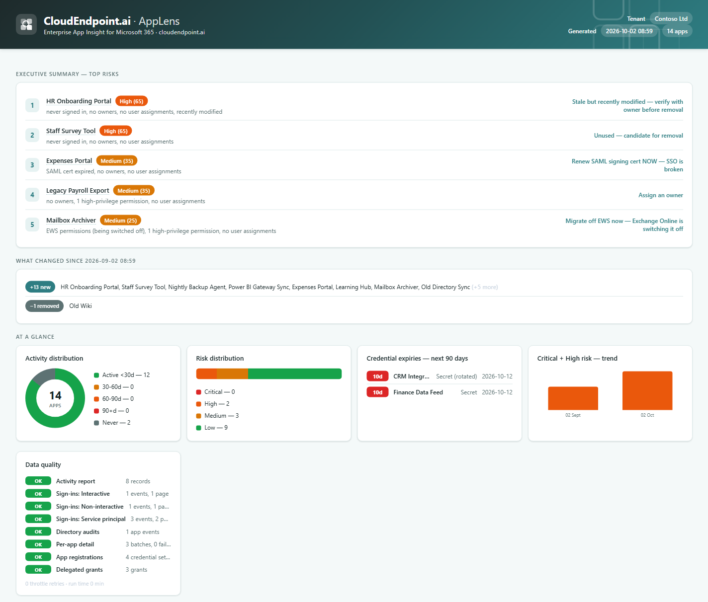

# AppLens by CloudEndpoint.ai

**Find the forgotten, risky and about-to-break apps in your Microsoft 365 tenant — in one report.**

[](#quick-start)
[](#is-it-safe-to-run)
[](LICENSE)

Every Entra ID tenant collects enterprise apps: trials nobody cancelled, integrations whose owner left,
consented tools with far more access than they need. AppLens inventories every one of them, scores the
risk, and tells you what to do next — in a single interactive HTML file you can filter, sort and export.


<sub>Demo tenant with fictional data.</sub>

---

## What it checks

| Check | Why it matters |
|---|---|
| **Sign-in activity** — active, 30/60/90+ days stale, or no sign-in on record | Unused apps are attack surface with no benefit. Combines the Entra activity report with 30 days of interactive, non-interactive and service principal sign-ins. |
| **SAML signing certificate** — the *active* cert only | An expired SAML cert locks every user out. Inactive leftovers don't mask or fake an expiry. |
| **Secrets and certificates** — rotation-aware | Spots expired and expiring credentials, without nagging about an old secret that's already been replaced. |
| **Provisioning (SCIM)** | Quarantined or paused sync jobs silently stop joiners and leavers flowing. |
| **Owners** | Apps nobody owns never get reviewed. AI agent identities are judged by their sponsors instead. |
| **App-only and delegated permissions** — resolved to names, high-privilege ones flagged | `Mail.ReadWrite`, `Directory.ReadWrite.All` and friends on a stale app are a breach waiting to happen. Tenant-wide consent is called out. |
| **Legacy APIs** | Apps still holding **EWS** permissions will break as Exchange Online switches EWS off (October 2026 to April 2027). Retired **Azure AD Graph** permissions mark apps nobody has maintained. |
| **AI agents** | Entra Agent ID identities and blueprints are labelled so they're easy to review. |
| **Recent admin changes** | A "stale" app someone edited last week probably isn't dead — removal advice is softened. |

Everything rolls up into a **0–100 risk score** (Low / Medium / High / Critical) and **one recommended action per
app**, such as *"Renew SAML signing cert NOW — SSO is broken"* or *"Unused — candidate for removal"*.

The report also includes an executive summary of the top five risks, a month-on-month **"what changed"**
section, a credential expiry timeline, a risk trend chart, and a **data quality panel** that shows exactly which
data sources succeeded, so a failed lookup is never mistaken for a clean result.

---

## Quick start

**You need:**
- Windows PowerShell 5.1 or PowerShell 7+
- An account that can read the directory and sign-in logs — **Global Reader** is the simplest read-only choice
- **Entra ID P1 or P2** for sign-in activity data (the rest of the report works without it)

```powershell
git clone https://github.com/jonjarvis87/AppLens.git
cd AppLens
.\Get-EnterpriseAppReport.ps1
```

The first run installs the Microsoft Graph PowerShell modules if they're missing and opens a browser to sign in.
The first time it's used in a tenant, an admin needs to consent to the read-only scopes below. The report opens
in your browser when it's done — typically 5–30 minutes depending on tenant size.

> **Downloaded the ZIP instead of cloning?** Windows marks downloaded scripts as untrusted. Run
> `Get-ChildItem -Recurse | Unblock-File` in the folder first, or you'll see "is not digitally signed".

### Options

| Parameter | What it does |
|---|---|
| `-OutputPath` | Where to write the report (default: `AppLens-Report.html` next to the script) |
| `-TenantId` | Sign in to a specific tenant |
| `-IncludeMicrosoftApps` | Include Microsoft's own first-party apps (excluded by default) |
| `-SignInLogDays` | Sign-in log lookback, 1–30 days (default 30) |
| `-SkipDetailedAnalysis` | Faster run without owners, assignments, permissions or provisioning |
| `-SendEmail -SenderUpn -RecipientUpns` | Email the report via Microsoft Graph (adds the `Mail.Send` scope) |

Run it again later and the **"what changed"** section compares against the previous run's snapshot.

---

## Is it safe to run?

- **Read-only.** It only reads from Microsoft Graph. The one exception is sending mail, and only if you ask for `-SendEmail`.
- **Nothing leaves your machine.** The report is a single self-contained HTML file: no telemetry, no external scripts, fonts or CDNs. The only network calls go to Microsoft Graph (and the PowerShell Gallery if modules need installing).
- **Hardened output.** App names and URLs are publisher-controlled, so all tenant data is HTML-encoded, only `http(s)` links are rendered, and the CSV export neutralises spreadsheet formulas.
- **Treat the report as sensitive.** It's a map of your tenant's apps, owners and permissions. The `.gitignore` keeps reports and snapshots out of source control.

### Permissions

Delegated scopes for interactive runs (application permissions for Azure Automation):

| Permission | Used for |
|---|---|
| `Application.Read.All` | Enterprise apps, app registrations, owners, permission grants |
| `AuditLog.Read.All` | Sign-in activity report, sign-in logs, directory audit log |
| `Directory.Read.All` | Organisation name and directory lookups |
| `Synchronization.Read.All` | Provisioning (SCIM) job status |
| `Mail.Send` | Only with `-SendEmail` |

---

## Monthly reports with Azure Automation

Run AppLens monthly from Azure Automation with a Managed Identity — no stored credentials — and email the report
to your admin team. `Mail.Send` is scoped to a single sender mailbox using Exchange RBAC for Applications.

```powershell
.\Setup-AppLensAutomation.ps1 -SubscriptionId '<subscription-guid>' `
    -SenderUpn 'applens@yourdomain.com' -RecipientUpns @('admin@yourdomain.com')
```

The setup script creates the resource group, Automation Account, modules, runbook and schedule, then prints the
permission scripts to run. Full walkthrough: **[APPLENS-AUTOMATION-SETUP.md](APPLENS-AUTOMATION-SETUP.md)**.
It uses the free tier of Azure Automation (500 minutes a month), so it typically costs nothing.

---

## Reading the report

- **Risk bands:** Low < 20 · Medium 20–44 · High 45–69 · Critical 70+.
- **"Never"** means *no sign-in on record* in the activity report or the sign-in log window — not necessarily that the app has never been used.
- **"?"** in a count means that lookup failed. It's excluded from scoring rather than treated as zero, and shows up in the data quality panel.
- **Click any row** for the detail panel. **Click an app name** to open it in the Entra admin centre. **Click a summary card** to filter.

## Limitations

- Sign-in activity and sign-in event types use Microsoft Graph **beta** endpoints, which Microsoft can change.
- Sign-in logs only go back 30 days, and reading them needs Entra ID P1/P2.
- AI agent sponsors aren't read, because Microsoft only allows that with a write permission. AppLens relies on Entra requiring a sponsor for every agent identity.

## Files

| File | Purpose |
|---|---|
| [`Get-EnterpriseAppReport.ps1`](Get-EnterpriseAppReport.ps1) | The report. Runs interactively or as an Azure Automation runbook. |
| [`Setup-AppLensAutomation.ps1`](Setup-AppLensAutomation.ps1) | One-shot Azure Automation bootstrap. |
| [`APPLENS-AUTOMATION-SETUP.md`](APPLENS-AUTOMATION-SETUP.md) | Step-by-step automation guide and troubleshooting. |

---

## Licence

[MIT](LICENSE) — free to use, change and share. Issues and pull requests welcome.

© 2026 CloudEndpoint.ai · [cloudendpoint.ai](https://cloudendpoint.ai)
